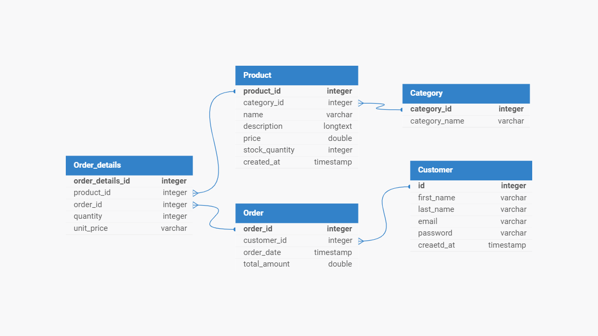

### Relations
Customer and Order:

1. Each customer can place multiple orders.
This is a one-to-many relationship, where one customer can have many orders, but each order belongs to only one customer.


2. Each order can have multiple order details, representing the products included in that order.
This is a one-to-many relationship, where one order can have multiple order details, but each order detail belongs to only one order.
Product and Category:

3. Each product belongs to one category.
This is a one-to-one relationship, where each product is associated with one category, and each category can have multiple products.

4. Each order detail is associated with one product.
This is a many-to-one relationship, where many order details can refer to the same product, but each order detail can only refer to one product.
Order and Customer:

5. Each order is placed by one customer.
This is a many-to-one relationship, where many orders can be associated with the same customer, but each order is associated with only one customer.


### ERD DIAGRAM



###  DB schema script
```
CREATE TABLE Customer (
    id INTEGER PRIMARY KEY AUTO_INCREMENT,
    first_name VARCHAR(255),
    last_name VARCHAR(255),
    email VARCHAR(255) UNIQUE,
    password VARCHAR(255),
    created_at TIMESTAMP
);

CREATE TABLE Category (
    category_id INTEGER PRIMARY KEY AUTO_INCREMENT,
    category_name VARCHAR(255)
);

CREATE TABLE Product (
    product_id INTEGER PRIMARY KEY AUTO_INCREMENT,
    category_id INTEGER,
    name VARCHAR(255),
    description TEXT,
    price DECIMAL(19,2),
    stock_quantity INTEGER,
    created_at TIMESTAMP,
    FOREIGN KEY (category_id) REFERENCES Category(category_id)
);

CREATE TABLE Orders (
    order_id INTEGER PRIMARY KEY AUTO_INCREMENT,
    customer_id INTEGER,
    order_date TIMESTAMP,
    total_amount DECIMAL(19,2),
    FOREIGN KEY (customer_id) REFERENCES Customer(id)
);

CREATE TABLE Order_details (
    order_details_id INTEGER PRIMARY KEY AUTO_INCREMENT,
    product_id INTEGER,
    order_id INTEGER,
    quantity INTEGER,
    unit_price DECIMAL(19,2),
    FOREIGN KEY (product_id) REFERENCES Product(product_id),
    FOREIGN KEY (order_id) REFERENCES Orders(order_id)
);

```


### Get Today revenue or any date revenue replace  ```CURDATE()``` with valid date
```
SELECT 
    DATE(order_date) AS date,
    SUM(total_amount) AS revenue
FROM 
    Orders
WHERE 
    DATE(order_date) = CURDATE() 
GROUP BY 
    DATE(order_date);
```

### SQL query to generate a monthly report of the top-selling products in a given month
```

SELECT
    order_details.product_id,
    product.name AS product_name,
    SUM(order_details.quantity) AS total_sold
FROM
    Order_details
JOIN
    product ON order_details.product_id = product.product_id
 JOIN
    orders ON orders.order_id = order_details.order_id
WHERE
    MONTH(orders.order_date) = 5 
    AND YEAR(orders.order_date) = 2024 
GROUP BY
    product.product_id,
    product.name
ORDER BY
    total_sold DESC;
```


####  SQL query to retrieve a list of customers who have placed orders totaling more than $500 in the past month.
```

SELECT 
    customer.id,
    customer.first_name,
    customer.last_name,
    SUM(orders.total_amount) AS total_last_month
FROM 
    orders
JOIN 
    customer  ON customer.id = orders.customer_id
WHERE 
    orders.order_date >= DATE_SUB(CURDATE(), INTERVAL 1 MONTH)
GROUP BY 
    customer.id
HAVING 
    SUM(orders.total_amount) > 500;
```


###  How we can apply a denormalization mechanism on customer and order entities.

1. add total_amount_spent in customer table
2. add number_of_orders in customer table
